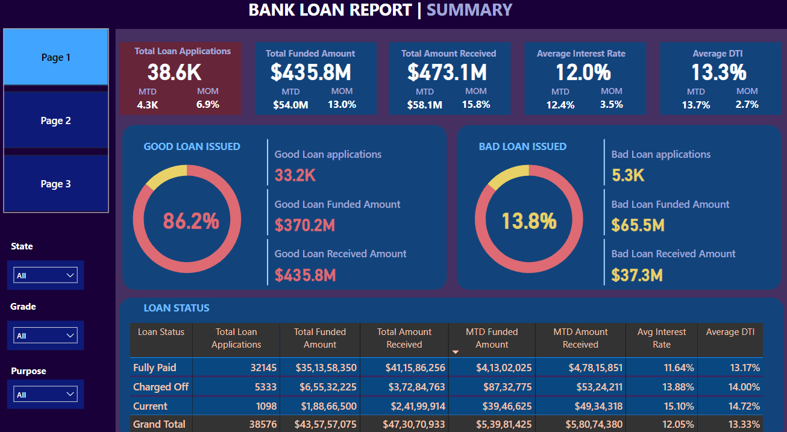
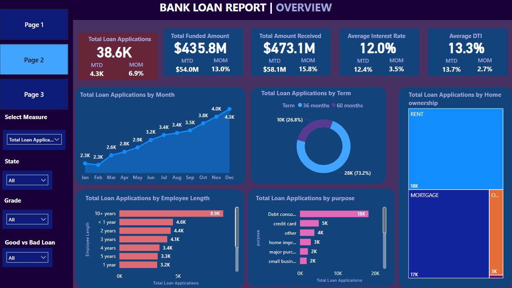
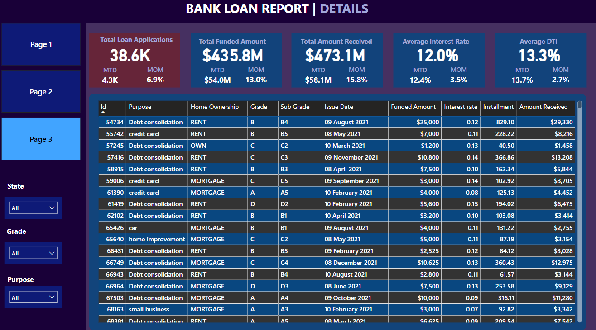

# Coffee-Shop-Sales-Excel-Dashboard-Project :)

1.) An interactive dashboard has been made using Power BI for bank loan data.

2.) Different charts have been plotted to study various trends such as Good Loan issued and Bad Loan issued,Total Loan Applications by month and by term and more.....

3.) Slicers have been added to view the data according to a given state,grade of loan,purpose of loan etc.

## These are the different pages of the dashboard:

